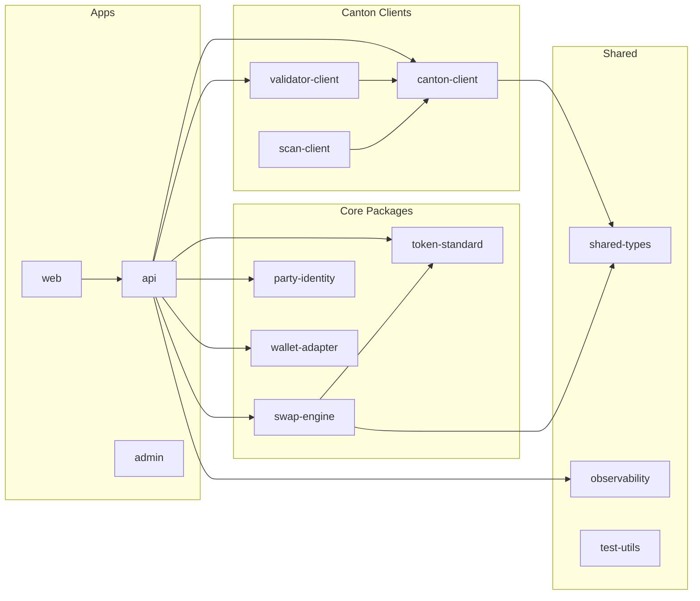
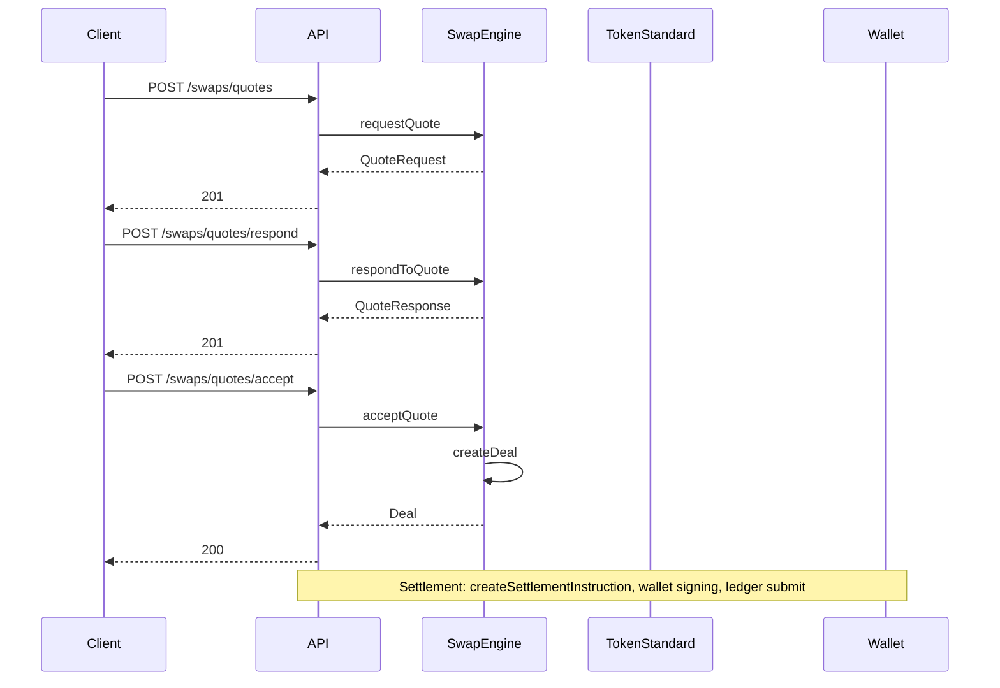

# Architecture

Package map, structure, and dependency graph for Canton MVP.

## Overview

## Apps

| App | Port | Purpose |
|-----|------|---------|
| **web** | 3000 | Reference frontend: onboarding, wallet, tokens, swaps, ops |
| **api** | 8080 | Backend: auth, parties, wallet, tokens, swaps, admin |
| **admin** | 3001 | Admin dashboard (optional) |
| **docs-site** | — | Documentation site (VitePress) |

## Packages

### Canton clients

| Package | Purpose |
|---------|---------|
| **canton-client** | JSON Ledger API v2: submit-and-wait, commands, events |
| **validator-client** | Validator API: user, DSO party, metadata |
| **scan-client** | Scan API: scans, transfer registry |

### Domain

| Package | Purpose |
|---------|---------|
| **swap-engine** | Quote/deal orchestration, state machine, settlement instruction |
| **token-standard** | CIP-0056: holdings, settlement, swap legs |
| **wallet-adapter** | CIP-103: connect, session, signing, holdings |
| **party-identity** | User, party, permissions, wallet linkage |

### Shared

| Package | Purpose |
|---------|---------|
| **shared-types** | PartyId, CantonConfig, DTOs |
| **observability** | Logging, correlation IDs, OTEL/metrics stubs |
| **test-utils** | Mocks (Validator, Scan, Ledger), Daml fixtures |
| **daml-models** | Daml source, generated types |
| **eslint-config** | Shared ESLint config |

## Examples & Integrations

| Path | Purpose |
|------|---------|
| **examples/example-wallet** | Wallet session + holdings/balances |
| **examples/example-swap-flow** | RFQ → respond → accept → deal |
| **examples/example-app-onboarding** | User → party → wallet → holdings |
| **integrations/api-client** | Minimal API client for Node/browser |

Examples use only the API; no direct package imports.

## Data Flow (Swap)

## Trust Boundaries

| Boundary | Description |
|----------|-------------|
| **Client → API** | Bearer/JWT auth |
| **API → Canton** | TLS, optional mTLS |
| **Wallet** | Signing boundary; keys never leave wallet |

See [docs/deployment-trust-boundaries.md](docs/deployment-trust-boundaries.md).
