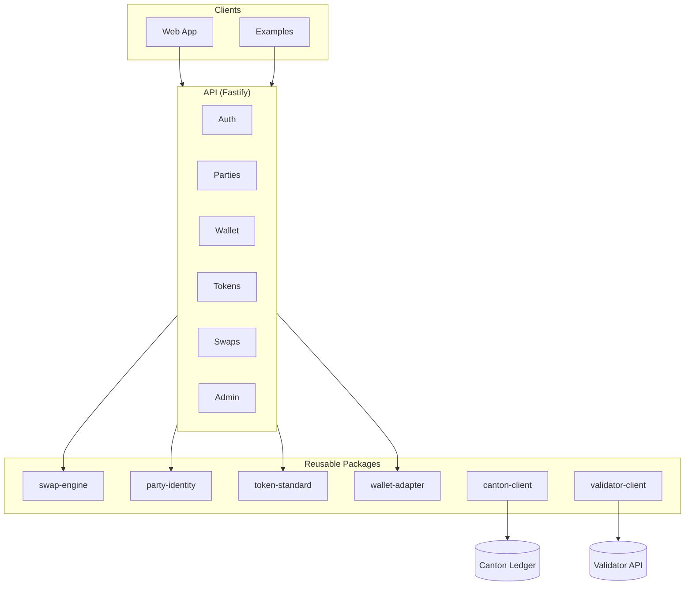
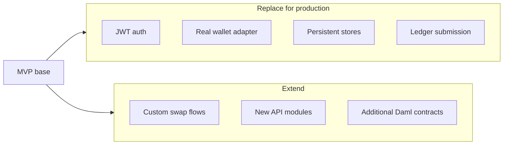

# Canton MVP

A forkable starter kit for building Canton Network applications. TypeScript monorepo with API, web app, reusable packages, and documented patterns.

> **Disclaimer:** This is a starter kit and reference implementation, not a production-complete system. Ledger submission, persistent stores, real wallet adapters, and full auth flows require additional wiring. See [docs/stubs-and-boundaries.md](docs/stubs-and-boundaries.md) for what is mock, dev-only, or intentionally incomplete.

## What It Is

Canton MVP provides:

- **API** — Fastify server with auth, party mapping, wallet session, tokens, and swap orchestration
- **Web app** — Next.js reference frontend (onboarding, wallet, balances, swaps, ops)
- **Packages** — Canton clients (Ledger, Validator, Scan), wallet adapter, token-standard, swap-engine
- **Examples** — Thin clients that prove the API is the contract
- **Docs** — Architecture, security, testing, extension guides

No Canton runtime required for local development. Mock wallet and in-memory stores let you run and test without a ledger.

## Who It Is For

- **Teams building on Canton** — OTC desks, settlement services, token platforms
- **Developers forking a base** — Clear boundaries, documented extension points
- **Builders who want TypeScript** — End-to-end TS, strict config, shared types

## Supported Use Cases

| Use case | Supported | Notes |
|----------|-----------|-------|
| Onboarding (user, party, wallet) | ✅ | Party allocation, wallet connect |
| Wallet-backed asset viewer | ✅ | Holdings, balances via API |
| RFQ / bilateral swap | ✅ | Quote request → respond → accept → deal |
| Settlement preparation | ✅ | Deal legs, pre-checks, approvals |
| Ledger submission | 🔶 | Swap-engine creates instruction; wire canton-client |
| Admin / ops dashboard | ✅ | Health, errors, swap states, party audit |
| `/metrics` endpoint | ✅ | Minimal JSON; wire to prom-client for full metrics |
| Production deployment | 🔶 | JWT, rate limiting, mTLS config; see hardening checklist |

## Architecture



## Quick Start

```bash
# Prerequisites: Node.js 20+, pnpm 9+
pnpm install
pnpm build

# Start API + web
pnpm dev:api    # Terminal 1 — API on :8080
pnpm dev:web    # Terminal 2 — Web on :3000
```

Or with Make: `make setup` then `make dev-api` and `make dev-web`.

**First run**: Open http://localhost:3000, go to Connect, sign in (mock: any `externalId`). Use `externalId: admin` for ops access.

## Package Map

| Package | Purpose |
|---------|---------|
| **canton-client** | JSON Ledger API v2 client |
| **validator-client** | Canton Validator API client |
| **scan-client** | Scan API client |
| **wallet-adapter** | CIP-103 wallet abstraction (MockWalletAdapter for dev) |
| **token-standard** | CIP-0056 token operations, settlement |
| **swap-engine** | Quote/deal orchestration, state machine |
| **party-identity** | User, party, permissions |
| **observability** | Logging, correlation IDs, metrics stubs |
| **shared-types** | Shared TypeScript types |
| **test-utils** | Mocks, fixtures, Daml payloads |
| **daml-models** | Daml contracts + generated types |

See [ARCHITECTURE.md](ARCHITECTURE.md) for full map and dependency graph.

## Extension Guide



1. **Replace mock auth** — Set `AUTH_JWT_SECRET`, wire JWT validation. See [docs/security-model.md](docs/security-model.md).
2. **Replace MockWalletAdapter** — Use `DappSdkAdapter` or `WalletSdkAdapter` in API context.
3. **Add persistence** — Implement `ISwapEngineStore`, `IPartyIdentityStore` with SQL/event store.
4. **Wire ledger submission** — Use `createSettlementInstruction` + canton-client `submitAndWait`.
5. **Add custom flows** — Extend swap-engine or add new modules; API follows same pattern.

See [docs/swap-extension-guide.md](docs/swap-extension-guide.md) and [docs/examples-index.md](docs/examples-index.md).

## Documentation

| Doc | Purpose |
|-----|---------|
| [ARCHITECTURE.md](ARCHITECTURE.md) | Package map, structure, dependencies |
| [CONTRIBUTING.md](CONTRIBUTING.md) | How to contribute |
| [ROADMAP.md](ROADMAP.md) | Planned work |
| [RELEASE.md](RELEASE.md) | Release process, first-release checklist |
| [SECURITY.md](SECURITY.md) | Vulnerability reporting |
| [docs/](docs/) | API design, security, testing, examples |

## License

Apache-2.0
